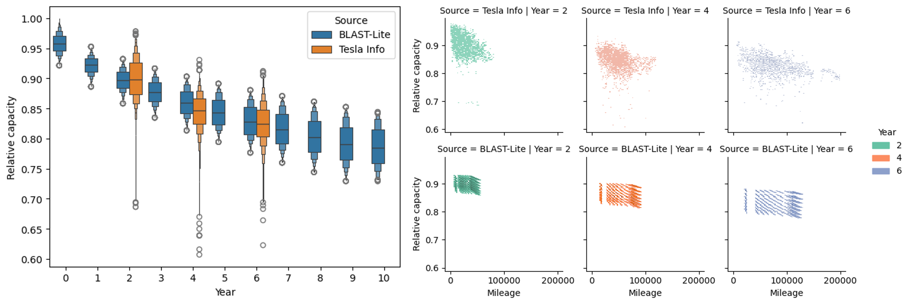
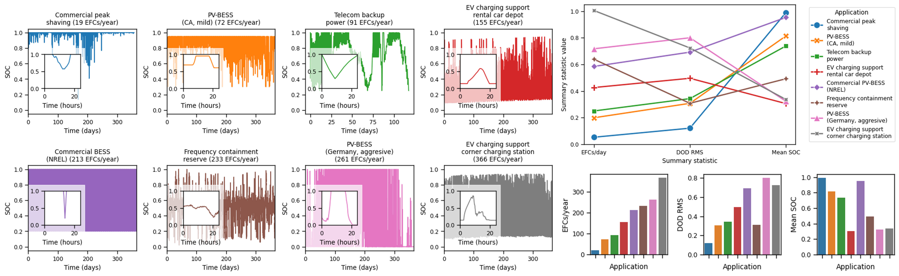
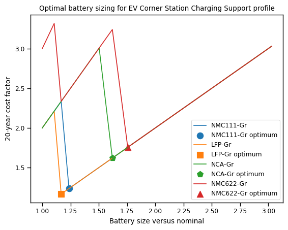
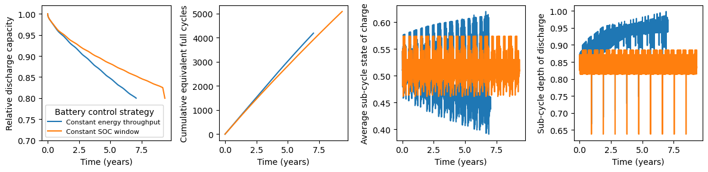
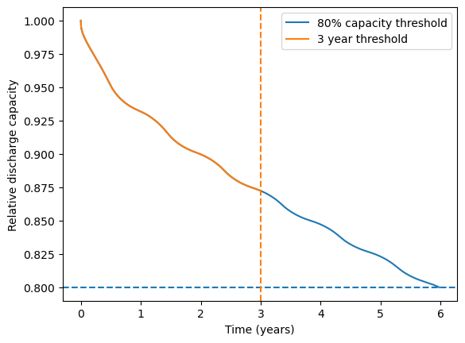
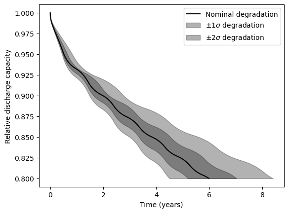

# BLAST-Lite
Battery Lifetime Analysis and Simulation Toolsuite (BLAST) provides a library of battery lifetime and degradation models for various commercial lithium-ion batteries from recent years. Degradation models are indentified from publically available lab-based aging data using NREL's battery life model identification toolkit. The battery life models predicted the expected lifetime of batteries used in mobile or stationary applications as functions of their temperature and use (state-of-charge, depth-of-discharge, and charge/discharge rates). Model implementation is in both Python and MATLAB programming languages. The MATLAB code also provides example applications (stationary storage and EV), climate data, and simple thermal management options. For more information on battery health diagnostics, prediction, and optimization, see [NREL's Battery Lifespan](https://www.nrel.gov/transportation/battery-lifespan.html) webpage.

A wide variety of battery degradation models are provided for simulating batteries of different chemistries, manufacturers, formats, and capacities. All current examples are Lithium-ion batteries.


In addition to the capabilities in BLAST-Lite, [NREL's Electrochemical Energy Storage group](https://www.nrel.gov/transportation/energy-storage.html) has a wide-variety of modeling and simulation tools from nano-scale to megawatt-hour system level. Please contact us if you have further interest in NREL's battery modeling capabilities: <a href="mailto:Paul.Gasper\@nrel.gov">Paul.Gasper\@nrel.gov</a>, <a href="mailto:Kandler.Smith\@nrel.gov">Kandler.Smith\@nrel.gov</a>.

## Simulating real-world battery use cases
Battery degradation is a complex interplay between battery-specific degradation behaviors, battery operating strategy and controls, and environmental conditions. BLAST-Lite provides a simplified set of tools to enable exploration of battery degradation versus all of these parameters, and has pre-built tools to help evaluate the life of applications like electric vehicles and stationary energy storage systems with reasonable assumptions.

### Electric vehicles
Electric vehicle simulations are conducted after generating realistic state-of-charge profiles using NREL's [FASTSim vehicle simulation tool](https://www.nrel.gov/transportation/fastsim.html). The state-of-charge profile for an 'average' week of vehicle use can then be scaled according to annual vehicle miles traveled (VMT), using U.S. Department of Transportation data ([documented here](examples/application%20profiles/Electric%20vehicle/vehicle%20annual%20miles%20traveled%20distributions.xlsx)) to estimate the distribution of annual VMT across the U.S. population, utilizing the `scale_vehicle_profile_to_annual_efcs` function.

For example, the [Panasonic NCA-Gr 18650](blast/models/nca_gr_Panasonic3Ah_2018.py) battery model can be compared to real world Tesla Model 3 Long Range vehicle data (extracted from [https://tesla-info.com/](https://tesla-info.com/) YouTube videos), which used Panasonic NCA-Gr 21700 batteries from their first model year in 2018 through at least 2022. Both the distribution of annual VMT and degradation model variability need to be accounted for to match the observed distributions of capacity fade and miles driven.



### Stationary storage
Stationary storage battery systems vary substantially in their design, operation, and application. Specifically, the application can have huge impacts on battery lifetime, as operations like peak shaving or backup-power have completely different battery use than operations like PV load-firming or electric vehicle charging station support. Here, we have compiled a [wide variety of stationary storage system battery applications](examples/application%20profiles).



Degradation of batteries adds complexity to the sizing of battery systems for stationary storage applications, as there is a trade-off between intial cost of the battery and the degradation: oversizing a battery reduces degradation by reducing the stress on the battery to meet a given load, but the oversized battery costs more initially. However, it can be financially beneficial to oversize, if oversizing the battery results in fewer battery replacements over the working lifetime of the system. Battery degradation simulations can help make these trade-offs clear:



## Caveats
These battery models predict 'expected life', that is, battery life under nominal conditions. Many types of battery failure will not be predicted by these models:
- Overcharge or overdischarge
- Impact of physical damage, vibration, or humidity
- Operating outside of manufacturer performance and environmental limits, such as voltage, temperature, and charge/discharge rate limits
- Pack performance loss due to cell-to-cell inbalance

All models are trained on accelerated aging test data. While we can accelerate the freqeuncy of cycles in the lab compared to the real world, we cannot accelerate the passage of time. Thus all models are trained on data collected over just 1-3 years, and we are extrapolating these models to predict real world lifetimes of 10+ years. As such, it is good to treat all models as qualitative. Also, over extremely long periods of time in the real-world, new bad things might happen that were not observed during accelerated aging.

Aging models are generally trained on a limited amount of data, that is, there is not enough information to estimate cell-to-cell variability in degradation rates.
Battery 'warranty life' is generally much more conservative than 'expected life'. 
These models are estimating cell level degradation, there will be additional performance penalties and caveats for estimating lifetime of battery packs. A good rule-of-thumb is to assume that pack lifetime is 20-30% less than cell lifetime, but when using life models trained on cell testing data, as all models here are, please support simulations of pack level degradation with pack level data if you have it.

## Setup and quick-start
### Installation

Set up and activate a Python environment:

```
conda create -n blast-lite python=3.12
conda activate blast-lite
```

Install BLAST-Lite via PyPI.
In the environment created and activate above, run `pip install blast-lite`.


#### Note: Fetching temperature data from NSRDB
The `blast.utils.get_nsrdb_temperature_data()` function uses an API key to access the NREL NSRDB for climate data for any requested location. If making many requests, please [get your own API key](https://developer.nrel.gov/signup) and replace the existing API key with yours in the 'examples\.hscfg' file. This configuration file is assumed by default to be in your 'home' folder, that is, the same folder as the code that is being run.

If using a Windows machine, you may need to additionally run the following:

`$ python -m pip install python-certifi-win32`.

```python
import certifi
import ssl
import geopy

ctx = ssl.create_default_context(cafile=certifi.where())
geopy.geocoders.options.default_ssl_context = ctx
```


### Quickstart
Once the package is installed, you can generate an example usage dataset by running:

```python
from blast import utils
data = utils.generate_example_data()
```

To see a list of available battery models, run:
```python
from blast import models
models.available_models()
```

Select a model, instantiate a cell, and run the simulation:
```python
cell = models.Lfp_Gr_250AhPrismatic()
cell.simulate_battery_life(data)
```

See the various example files for more detail on the different capabilities in BLAST-Lite:
- [Broad overview of capabilities and tools](examples/example.ipynb)
- [Running simplified but extremely fast simulations](examples/example_fast_calculations.ipynb)
- [Simulation of electric vehicle lifetime](examples/example_EV_life.ipynb)
- [Simulation and analysis of stationary storage batteries](examples/example_stationary_storage_life.ipynb)

## Simulation details
Simplistic assumptions related to battery control can be easily selected. Given a state-of-charge timeseries, there are two straightforward ways this state-of-charge profile can evolve over time:
- Conserve energy throughput, that is, increase the size of state-of-charge swings as the battery ages. Basically, as the battery degrades, the depth-of-discharge (and average state-of-charge) will decrease as the battery needs to discharge to a lower SOC to provide the same amount of energy for every discharge/charge event. This is more common for real world use, where a battery is designed to always deliver a certain amount of energy.
- Maintain constant state-of-charge limits, which effectively decreases the energy-throughput per cycle as the battery ages. This is not a very common strategy in real world use, as you'd be getting less use out of the battery (it's like driving an electric vehicle fewer miles each trip as the battery degraded), but is common when running accelerated aging tests where cells are cycled between unchanging voltage limits.

These assumptions are highly simplistic. The BLAST degradation modeling framework could be coupled with a more realistic battery performance model and simulated battery controllers to result in more accurate simulations, but obviously at increased computational cost and effort.



Simple time-, capacity-, or charge-throughput based thresholds can be used to easily run simulations to specific endpoints.



While we do not have the data to model every single type of battery, it is easy to scale any model in BLAST-Lite to have faster or slower degradation via the optional `degradation_scalar` input when instantiating a model. Varying the `degradation_scalar` also can quickly tune any model to capture the variability of degradation observed in the real world or during testing, with the helper function `simulate_battery_life_distribution` available to make this quick and easy.



## Citations
 - Sony Murata LFP-Gr battery aging data and model
     - [Calendar aging data source](https://doi.org/10.1016/j.est.2018.01.019)
     - [Cycle aging data source](https://doi.org/10.1016/j.jpowsour.2019.227666)
     - [Model identification source](https://doi.org/10.1149/1945-7111/ac86a8)
 - Nissan Leaf LMO-Gr (2nd life cells) battery aging data
     - [Calendar aging data source](https://doi.org/10.1109/EEEIC/ICPSEUROPE54979.2022.9854784)
     - [Cycle aging data source](https://doi.org/10.1016/j.est.2020.101695)
 - Panasonic NCA-Gr battery aging data
     - [Calendar aging data source](https://dx.doi.org/10.1149/2.0411609jes)
     - [Cycle aging data source](https://doi.org/10.1149/1945-7111/abae37)
 - [Sony Murata NCA-GrSi battery aging data](https://doi.org/10.1016/j.jpowsour.2022.232498)
     - Additional research by TUM on [mechanistic cycling](https://doi.org/10.1016/j.jpowsour.2023.233947) and [mechanistic calendar aging](https://doi.org/10.1016/j.jpowsour.2023.233208) models is not replicated here
 - [Commercial NMC-LTO battery aging data source](https://doi.org/10.1016/j.jpowsour.2020.228566)
 - [Kokam NMC111-Gr battery aging data source](https://ieeexplore.ieee.org/iel7/7951530/7962914/07963578.pdf)
 - [Sanyo NMC111-Gr battery aging model source](http://dx.doi.org/10.1016/j.jpowsour.2014.02.012)
 - [LG MJ1 NMC811-GrSi battery aging data source](https://everlasting-project.eu/wp-content/uploads/2020/03/EVERLASTING_D2.3_final_20200228.pdf)
 - [LG M50 NMC811-GrSi battery aging data source, provided by request from original authors](https://ieeexplore.ieee.org/document/9617644)
 - Models of commercially produced (> 1 GWh / yr manufacturers), large format Li-ion cells from a [2023 Journal of Energy Storage paper](https://doi.org/10.1016/j.est.2023.109042)
    - 250 Ah LFP-Gr (high energy density, very low power)
    - 75 Ah NMC-Gr 'A' (relatively high power, suitable for fast charging)
    - 50 Ah NMC-GR 'B1' (relatively high power, suitable for fast charging)
    - 50 Ah NMC-Gr 'B2' (higher energy density than B1 but lower power, questionable performance and durability under fast charging demands)
 - [DENSO NMC622-Gr battery aging model source](https://iopscience.iop.org/article/10.1149/1945-7111/ac2ebd)
 - Stationary storage battery use profiles are [provided open-source](https://dataserv.ub.tum.de/index.php/s/m1510254) by [Kucevic et al](https://www.sciencedirect.com/science/article/pii/S2352152X19309016)
 - Electric vehicle battery use profiles were generated using NREL's [FASTSim tool](https://www.nrel.gov/transportation/fastsim.html).
 - Some stationary storage battery use profiles were generated using NREL simulation tools: [REopt](https://reopt.nrel.gov/tool), [System Advisor Model](https://sam.nrel.gov/), [EVI-EDGES](https://www.nrel.gov/transportation/evi-edges.html)

### Acknowledgements
Funding provided by U.S. Department of Energy Vehicle Technologies Office.

Special thanks to some keen-eyed users who noticed mistakes to correct:
- Adam Thelen
- Llejlla Gusinjac
- Corey Randall

### Authors
Paul Gasper, Nina Prakash, Kandler Smith

NREL SWR-22-69
