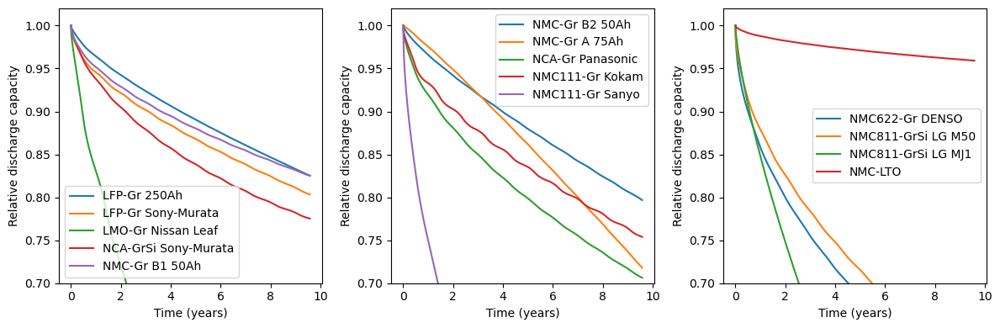

# BLAST-Lite
Battery Lifetime Analysis and Simulation Toolsuite (BLAST) provides a library of battery lifetime and degradation models for various commercial lithium-ion batteries from recent years. Degradation models are indentified from publically available lab-based aging data using NREL's battery life model identification toolkit. The battery life models predicted the expected lifetime of batteries used in mobile or stationary applications as functions of their temperature and use (state-of-charge, depth-of-discharge, and charge/discharge rates). Model implementation is in both Python and MATLAB programming languages. The MATLAB code also provides example applications (stationary storage and EV), climate data, and simple thermal management options. For more information on battery health diagnostics, prediction, and optimization, see [NREL's Battery Lifespan](https://www.nrel.gov/transportation/battery-lifespan.html) webpage.

A wide variety of battery degradation models are provided for simulating batteries of different chemistries, manufacturers, formats, and capacities. All current examples are Lithium-ion batteries.



Simplistic assumptions related to battery control can be easily selected. Given a state-of-charge timeseries, there are two straightforward ways this state-of-charge profile can evolve over time:
- Conserve energy throughput, that is, increase the size of state-of-charge swings as the battery ages. Basically, as the battery degrades, the depth-of-discharge (and average state-of-charge) will decrease as the battery needs to discharge to a lower SOC to provide the same amount of energy for every discharge/charge event.
- Maintain constant state-of-charge limits, which effectively decreases the energy-throughput per cycle as the battery ages. This is not a very common strategy, as you'd be getting less use out of the battery (it's like driving an electric vehicle fewer miles each trip as the battery degraded), but does tend to extend battery lifetime.

These assumptions are highly simplistic. The BLAST degradation modeling framework could be coupled with a more realistic battery performance model and simulated battery controllers to result in more accurate simulations, but obviously at increased computational cost and effort.


Simple time- or capacity-based thresholds can be used to easily run simulations to specific endpoints.


### Installation

Set up and activate a Python environment:

```
conda create -n blast-lite python=3.12
conda activate blast-lite
```

Install BLAST-Lite via PyPI.
In the environment created and activate above, run `pip install blast-lite`.


#### Note: Fetching temperature data from NSRDB
The `blast.utils.get_nsrdb_temperature_data()` function uses an API key to access the NREL NSRDB for climate data for any requested location. If making many requests, please [get your own API key](https://developer.nrel.gov/signup) and replace the existing API key with yours in the 'examples\.hscfg' file. This configuration file is assumed by default to be in your 'home' folder, that is, the same folder as the code that is being run.

If using a Windows machine, you may need to additionally run the following:

`$ python -m pip install python-certifi-win32`.

```python
import certifi
import ssl
import geopy

ctx = ssl.create_default_context(cafile=certifi.where())
geopy.geocoders.options.default_ssl_context = ctx
```


### Quickstart
Once the package is installed, you can generate an example usage dataset by running:

```python
from blast import utils
data = utils.generate_example_data()
```

To see a list of available battery models, run:
```python
from blast import models
models.available_models()
```

Select a model, instantiate a cell, and run the simulation:
```python
cell = models.Lfp_Gr_250AhPrismatic()
cell.simulate_battery_life(data)
```

### Caveats
These battery models predict 'expected life', that is, battery life under nominal conditions. Many types of battery failure will not be predicted by these models:
- Overcharge or overdischarge
- Impact of physical damage, vibration, or humidity
- Operating outside of manufacturer performance and environmental limits, such as voltage, temperature, and charge/discharge rate limits
- Pack performance loss due to cell-to-cell inbalance

Aging models are generally trained on a limited amount of data, that is, there is not enough information to estimate cell-to-cell variability in degradation rates.
Battery 'warranty life' is generally much more conservative than 'expected life'. 
These models are estimating cell level degradation, there will be additional performance penalties and caveats for estimating lifetime of battery packs. 
A good rule-of-thumb is to assume that pack lifetime is 20-30% less than cell lifetime, but please support model simulations with data if you have it.

### Citations
 - Sony Murata LFP-Gr battery aging data and model
     - [Calendar aging data source](https://doi.org/10.1016/j.est.2018.01.019)
     - [Cycle aging data source](https://doi.org/10.1016/j.jpowsour.2019.227666)
     - [Model identification source](https://doi.org/10.1149/1945-7111/ac86a8)
 - Nissan Leaf LMO-Gr (2nd life cells) battery aging data
     - [Calendar aging data source](https://doi.org/10.1109/EEEIC/ICPSEUROPE54979.2022.9854784)
     - [Cycle aging data source](https://doi.org/10.1016/j.est.2020.101695)
 - Panasonic NCA-Gr battery aging data
     - [Calendar aging data source](https://dx.doi.org/10.1149/2.0411609jes)
     - [Cycle aging data source](https://doi.org/10.1149/1945-7111/abae37)
 - [Sony Murata NCA-GrSi battery aging data](https://doi.org/10.1016/j.jpowsour.2022.232498)
     - Additional research by TUM on [mechanistic cycling](https://doi.org/10.1016/j.jpowsour.2023.233947) and [mechanistic calendar aging](https://doi.org/10.1016/j.jpowsour.2023.233208) models is not replicated here
 - [Commercial NMC-LTO battery aging data source](https://doi.org/10.1016/j.jpowsour.2020.228566)
 - [Kokam NMC111-Gr battery aging data source](https://ieeexplore.ieee.org/iel7/7951530/7962914/07963578.pdf)
 - [Sanyo NMC111-Gr battery aging model source](http://dx.doi.org/10.1016/j.jpowsour.2014.02.012)
 - [LG MJ1 NMC811-GrSi battery aging data source](https://everlasting-project.eu/wp-content/uploads/2020/03/EVERLASTING_D2.3_final_20200228.pdf)
 - [LG M50 NMC811-GrSi battery aging data source, provided by request from original authors](https://ieeexplore.ieee.org/document/9617644)
 - Models of commercially produced (> 1 GWh / yr manufacturers), large format Li-ion cells from a [2023 Journal of Energy Storage paper](https://doi.org/10.1016/j.est.2023.109042)
    - 250 Ah LFP-Gr (high energy density, very low power)
    - 75 Ah NMC-Gr 'A' (relatively high power, suitable for fast charging)
    - 50 Ah NMC-GR 'B1' (relatively high power, suitable for fast charging)
    - 50 Ah NMC-Gr 'B2' (higher energy density than B1 but lower power, questionable performance and durability under fast charging demands)
 - [DENSO NMC622-Gr battery aging model source](https://iopscience.iop.org/article/10.1149/1945-7111/ac2ebd)
 - Stationary storage battery use profiles are [provided open-source](https://dataserv.ub.tum.de/index.php/s/m1510254) by [Kucevic et al](https://www.sciencedirect.com/science/article/pii/S2352152X19309016)
 - Electric vehicle battery use profiles were generated using NREL's [FASTSim tool](https://www.nrel.gov/transportation/fastsim.html).

### Authors
Paul Gasper, Nina Prakash, Kandler Smith

NREL SWR-22-69
