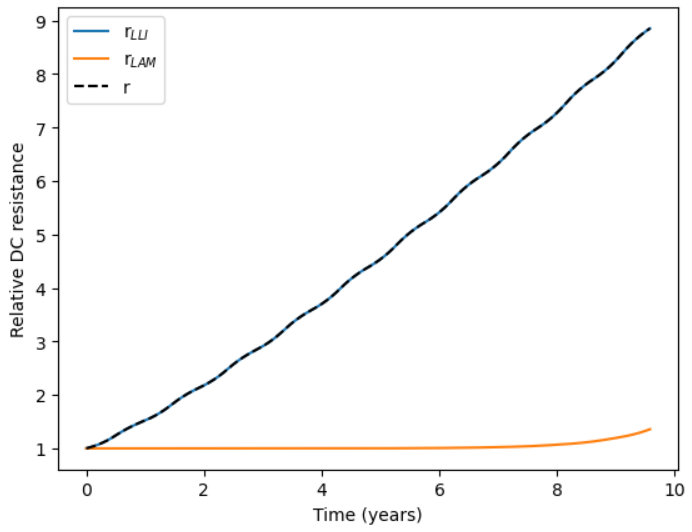

==========
User Guide
==========

This is a detailed user guide that demonstrates how to use the BLAST-Lite battery life models,
using the Kokam NMC111|Gr 75Ah battery life model as an example. The battery modeled here is a
high-power cell with long cycle life. Because nominal cell resistance is low, the relative change
of resistance at end-of-life is quite high compared to other cell designs (~300% increase in cell
resistance at 80% capacity if not more). Fade rates can be changed in the code to accomodate other cell models.
Documentation is provided in the life model class. See https://ieeexplore.ieee.org/abstract/document/7963578
for the aging test details and results used to parameterize this model.

.. code:: python
    
    from blast import utils, models

Generating input data
--------------------------------

To run, the life model needs three time series:

#. The time in seconds since beginning-of-life of the battery
#. The state-of-charge profile of the battery (0 to 1)
#. The ambient temperature (or battery temperature, if you have a thermal model).

These three time series should be fed to the life model in the form
of a dictionary with these keys:

* ``'Time_s'``
* ``'SOC'``
* ``'Temperature_C'``

and each time series should have the same length.

You can load your own data or fetch temperature data from the NSRDB
database using the the function ``utils.get_nsrdb_temperature_data()``.

.. code:: python

    climate = utils.get_nsrdb_temperature_data('Honolulu, Hawaii')

    plt.plot(climate['Time_s']/(3600*24), climate['Temperature_C'], linewidth=0.3)
    plt.plot(climate['Time_s']/(3600*24), climate['Temperature_C'].rolling(14*24*2).mean(), linewidth=3)
    plt.xlabel('Time (days)')
    plt.ylabel('Temperature (C)')

For the purpose of demonstration, you can also load a sample input dataset:

.. code:: python

    # Completely synthetic data
    input_synthetic = utils.generate_sample_data('synthetic')

    # Small personal EV in Honolulu, Hawaii
    input_ev_smallbattery = utils.generate_sample_data('ev_smallbattery')

    # Large personal EV in Honolulu, Hawaii
    input_ev_largebattery = utils.generate_sample_data('ev_largebattery')

    # Commercial EV in Honolulu, Hawaii
    input_ev_commercial = utils.generate_sample_data('ev_commercial')

    # Commercial EV in Honolulu, Hawaii - Low depth of discharge
    input_ev_commercial_lowdod = utils.generate_sample_data('ev_commercial_lowdod')

    # Commercial EV in Honolulu, Hawaii - Low depth of discharge and low SOC
    input_ev_commercial_lowdod_lowsoc = utils.generate_sample_data('ev_commercial_lowdod_lowsoc')

.. code:: python

    >> input_synthetic

*{'SOC': array([1. , 1. , 1. , ..., 0.2, 0.6, 1. ]),*
*'Temperature_C': array([20. , 20.91138081, 21.82276162, ..., 20.91136829, 20., 20.]),*
*'Time_s': array([0, 3600, 7200, ..., 315352800, 315356400, 315360000])}*

Visualize the sample profiles:

.. code:: python

    import matplotlib.pyplot as plt

    # Synthetic data
    fig, ax1 = plt.subplots()
    ax1.plot(input_synthetic['Time_s'][:25] / 3600, input_synthetic['SOC'][:25], '-k')
    ax1.set_xlabel('Time (hours)')
    ax1.set_ylabel('State-of-charge')

    ax2 = ax1.twinx()
    ax2.plot(input_synthetic['Time_s'][:25] / 3600, input_synthetic['Temperature_C'][:25], '-r')
    ax2.tick_params(axis='y', labelcolor='r')
    ax2.set_ylabel('Temperature (Celsius)', color='r')
    plt.show()

.. code:: python

    plt.plot(input_synthetic['Time_s'][:25] / 3600 /(24*365), input_synthetic['Temperature_C'])
    plt.xlabel('Time (years)')
    plt.ylabel('Temperature (Celsius)')
    plt.show()

.. code:: python

    # Sample EV SOC profiles
    plt.plot(input_ev_largebattery['Time_s'] / (24*3600), input_ev_largebattery['SOC'], label='Large battery EV')
    plt.plot(input_ev_smallbattery['Time_s'] / (24*3600), input_ev_smallbattery['SOC'], label='Small battery EV')
    plt.plot(input_ev_commercial['Time_s'] / (24*3600), input_ev_commercial['SOC'], label='Commercial EV')
    plt.xlabel('Time (days)')
    plt.ylabel('State of charge')
    plt.legend()

.. image:: assets/ev_profiles.PNG
    :width: 600

.. code:: python

    # Sample commercial EV SOC profiles
    plt.plot(input_ev_commercial['Time_s'] / (24*3600), input_ev_commercial['SOC'], label='Commercial EV')
    plt.plot(input_ev_commercial_lowdod['Time_s'] / (24*3600), input_ev_commercial_lowdod['SOC'], label='Commercial EV (Low DOD)')
    plt.plot(input_ev_commercial_lowdod_lowsoc['Time_s'] / (24*3600), input_ev_commercial_lowdod_lowsoc['SOC'], label='Commercial EV (Low DOD, Low SOC)')
    plt.xlabel('Time (days)')
    plt.ylabel('State of charge')
    plt.legend()

Instantiating a model
--------------------------------

To see a list of available models, run:

.. code-block:: python

    >> models.available_models()
    
*['Lfp_Gr_250AhPrismatic', 'Lfp_Gr_SonyMurata3Ah_Battery', 'Lmo_Gr_NissanLeaf66Ah_2ndLife_Battery', 'NCA_GrSi_SonyMurata2p5Ah_Battery', 'NMC_Gr_50Ah_B1', 'NMC_Gr_50Ah_B2', 'NMC_Gr_75Ah_A', 'Nca_Gr_Panasonic3Ah_Battery', 'Nmc111_Gr_Kokam75Ah_Battery', 'Nmc111_Gr_Sanyo2Ah_Battery', 'Nmc811_GrSi_LGMJ1_4Ah_Battery', 'Nmc_Lto_10Ah_Battery']*

Select a model and instantiate a cell:

.. code:: python

    from blast.models import Nmc111_Gr_Kokam75Ah_Battery
    
    cell = Nmc111_Gr_Kokam75Ah_Battery()

All battery models have five builtin properties stored as attributes of the model class. The first is **cap**, which is the nominal discharge capacity of the cell in Amp hours.

.. code:: python

    >> cell.cap

*75*

The next four track battery lifetime values, and store the history of the battery as lifetime is simulated  at each timestep/iteration:

- `states`: internal states of the battery model
    - Ex., time-dependent capacity loss
- `outputs`: battery properties calculated from states
    - Ex., relative discharge capacity
- `stressors`: values of stressors used by the model
    - Ex., temperature, depth-of-discharge, charge-throughput
    - Note that degradation rates are calculate from stressor timeseries, and then normalized for the timestep; for example, an Arrhenius expression would be evaluated from the temperature timeseries for the entire timestep, and then normalized by taking the time-based average - this gives a different value than if the Arrhenius expression was evaluated on the averager temperature. Other normalizations can include using the minimum or maximum value over the timestep, or using the root-mean-square.
- `rates`: values of degradation rates
    - Ex., time-dependent degradation rate due to temperature and state-of-charge

Battery models may have other properties, such as the open-circuit voltage as a function of state-of-charge, nominal DC resistance values, or first-life/second-life capacity definitions.

This specific battery model is relatively complex, and has many states and outputs that describe the degradation state of the battery. Properties `states`, `outputs`, `stressors`, and `rates` are all stored as dicts.

.. code:: python

    >> cell.outputs

*{'q': array([1]),*
 *'q_LLI': array([1]),
 'q_LLI_t': array([1]),
 'q_LLI_EFC': array([1]),
 'q_LAM': array([1.01]),
 'r': array([1]),
 'r_LLI': array([1]),
 'r_LLI_t': array([1]),
 'r_LLI_EFC': array([1]),
 'r_LAM': array([1])}*

The output descriptions are in the class definition, replicated here:

* q: relative capacity
* q_LLI: relative lithium inventory
* q_LLI_t: relative lithium inventory, time dependent loss
* q_LLI_EFC: relative lithium inventory, charge-throughput dependent loss
* q_LAM: relative active material, charge-throughput dependent loss
* r: relative resistance
* r_LLI: relative SEI resistance
* r_LLI_t: relative SEI resistance, time dependent growth
* r_LLI_EFC: relative SEI resistance, charge-throughput dependent growth
* r_LAM: relative electrode resistance, q_LAM dependent growth

Accesing one output/state/rate/stressor is simple:

.. code:: python

    >> cell.outputs['q']

*array([1])*

.. code:: python

    >> cell.stressors

*{'delta_t_days': array([nan]),
't_days': array([0]),
'delta_efc': array([nan]),
'efc': array([0]),
'TdegK': array([nan]),
'soc': array([nan]),
'Ua': array([nan]),
'dod': array([nan])}*

.. code:: python

    >> cell.rates

*{'q1': array([nan]),
'q3': array([nan]),
'q5': array([nan])}*

.. code:: python

    >> cell.states

*{'qLoss_LLI_t': array([0]),
'qLoss_LLI_EFC': array([0]),
'qLoss_LAM': array([1.e-08]),
'rGain_LLI_t': array([0]),
'rGain_LLI_EFC': array([0])}*

Running the simulation
--------------------------------

The battery model is run in timesteps relevant to battery degradation: either once a single equivalent
full cycle has been completed, or after 1 day. Cycles are detected using the rainflow algorithm, which
finds turning points in the SOC profile that are then processed to determine useful simulation timesteps
from the SOC profile. This is all done by the ``simulate_battery_life()`` function. The input timeseries
vectors needs to be given as a dictionary.

Each battery model tracks the history of it's inputs (``stressors``), calculated degradation rates (``rates``),
internal states (``states``), and outputs (``outputs``) each time ``update_battery_state()`` is called. Debugging models
is easier because the values of all inputs, internal calculations, and outputs are tracked.

Run the simulation:

.. code:: python

    cell.simulate_battery_life(input_synthetic)

Evaluating results
--------------------------------

To inspect the results, slice outputs from the cell:

.. code:: python

    plt.plot(cell.stressors['t_days']/365, cell.outputs['q'])
    plt.xlabel('Time (years)')
    plt.ylabel('Relative discharge capacity')
    plt.ylim((0.7, 1.02))
    plt.show()

The cell resistance and capacity trajectories are wiggily
because the temperature of the battery is varying throughout
each year, varying the degradation rate. Dispatch is the same
each day, so that is constant.

The model keeps track of how much charge-throughput has occured
throughout life, as well, based on the input state-of-charge timeseries.
Conversion from charge-throughput, in Amp-hours, to changes of cell
state-of-charge, which is dependent on battery performance (health,
temperature and SOC dependent resistances), is assumed to happen
externally to the model. This simple simulation is essentially assuming
that the current magnitude is continuously being adjusted based on
the state-of-health of the battery.

.. code:: python

    plt.plot(cell.stressors['efc'], cell.outputs['q'])
    plt.xlabel('Equivalent full cycles')
    plt.ylabel('Relative discharge capacity')
    plt.ylim((0.7, 1.02))
    plt.show()

This dispatch has a little more than 1 EFC per day.

We can plot the separate contributions to capacity or resistance fade, as well.

.. code:: python

    plt.plot(cell.stressors['t_days']/365, cell.outputs['q_LLI'])
    plt.plot(cell.stressors['t_days']/365, cell.outputs['q_LAM'])
    plt.plot(cell.stressors['t_days']/365, cell.outputs['q'], '--k')
    plt.xlabel('Time (years)')
    plt.ylabel('Relative discharge capacity')
    plt.legend([r'q$_{LLI}$', r'q$_{LAM}$', 'q'])
    plt.ylim((0.7, 1.02))

From the result, the cell will experience sudden failure very shortly;
considering this is near 70% remaining capacity, this is physically reasonable.

.. code:: python

    plt.plot(cell.stressors['t_days']/365, cell.outputs['r_LLI'])
    plt.plot(cell.stressors['t_days']/365, cell.outputs['r_LAM'])
    plt.plot(cell.stressors['t_days']/365, cell.outputs['r'], '--k')
    plt.xlabel('Time (years)')
    plt.ylabel('Relative DC resistance')
    plt.legend([r'r$_{LLI}$', r'r$_{LAM}$', 'r'])
    plt.show()

Comparing multiple models
-------------------------------------

Repeat the simulation with other battery life models with our synthetic input.

.. code:: python

    cell_nmc_kokam = models.Nmc111_Gr_Kokam75Ah_Battery()
    cell_nmc_kokam.simulate_battery_life(input_synthetic)

    cell_lfp = models.Lfp_Gr_SonyMurata3Ah_Battery()
    cell_lfp.simulate_battery_life(input_synthetic)

    cell_nmc_sanyo = models.Nmc111_Gr_Sanyo2Ah_Battery()
    cell_nmc_sanyo.simulate_battery_life(input_synthetic)

    cell_nmc811_grSi = models.Nmc811_GrSi_LGMJ1_4Ah_Battery()
    cell_nmc811_grSi.simulate_battery_life(input_synthetic)

    cell_nca = models.Nca_Gr_Panasonic3Ah_Battery()
    cell_nca.simulate_battery_life(input_synthetic)

    cell_nca_grsi = models.NCA_GrSi_SonyMurata2p5Ah_Battery()
    cell_nca_grsi.simulate_battery_life(input_synthetic)

    cell_nmc_lto = models.Nmc_Lto_10Ah_Battery()
    cell_nmc_lto.simulate_battery_life(input_synthetic)

    cell_lmo = models.Lmo_Gr_NissanLeaf66Ah_2ndLife_Battery()
    cell_lmo.simulate_battery_life(input_synthetic)

And slice the cell stressors and outputs to plot comparisons.

.. code:: python

    plt.plot(cell_nmc_kokam.stressors['t_days']/365,    cell_nmc_kokam.outputs['q'],    label=cell_nmc_kokam._label)
    plt.plot(cell_lfp.stressors['t_days']/365,          cell_lfp.outputs['q'],          label=cell_lfp._label)
    plt.plot(cell_nmc_sanyo.stressors['t_days']/365,    cell_nmc_sanyo.outputs['q'],    label=cell_nmc_sanyo._label)
    plt.plot(cell_nmc811_grSi.stressors['t_days']/365,  cell_nmc811_grSi.outputs['q'],  label=cell_nmc811_grSi._label)
    plt.plot(cell_nca.stressors['t_days']/365,          cell_nca.outputs['q'],          label=cell_nca._label)
    plt.plot(cell_nca_grsi.stressors['t_days']/365,     cell_nca_grsi.outputs['q'],     label=cell_nca_grsi._label)
    plt.plot(cell_nmc_lto.stressors['t_days']/365,      cell_nmc_lto.outputs['q'],      label=cell_nmc_lto._label)
    plt.plot(cell_lmo.stressors['t_days']/365,          cell_lmo.outputs['q'],          label=cell_lmo._label)
    plt.xlabel('Time (years)')
    plt.ylabel('Relative discharge capacity')
    plt.legend()
    plt.ylim((0.7, 1.02))
    plt.show()

We can also look at models of large format commercial Li-ion batteries from 2023 Journal of Energy Storage paper:
https://doi.org/10.1016/j.est.2023.109042

For the most part, these cells are newer than those in other models, and show longer lifetimes on average,
hopefully suggesting that modern commercially produced cells for electric vehicles and stationary energy
storage will have long lifetimes in real world applications. We estimated >11 years for all cells here
in a stationary storage application (frequency containment reserve).

.. code:: python

    cell_lfp = models.Lfp_Gr_250AhPrismatic()
    cell_lfp.simulate_battery_life(input_synthetic)

    cell_nmc_A = models.NMC_Gr_75Ah_A()
    cell_nmc_A.simulate_battery_life(input_synthetic)

    cell_nmc_B1 = models.NMC_Gr_50Ah_B1()
    cell_nmc_B1.simulate_battery_life(input_synthetic)

    cell_nmc_B2 = models.NMC_Gr_50Ah_B2()
    cell_nmc_B2.simulate_battery_life(input_synthetic)

    plt.plot(cell_lfp.stressors['t_days']/365,      cell_lfp.outputs['q'],      label=cell_lfp._label)
    plt.plot(cell_nmc_A.stressors['t_days']/365,    cell_nmc_A.outputs['q'],    label=cell_nmc_A._label)
    plt.plot(cell_nmc_B1.stressors['t_days']/365,   cell_nmc_B1.outputs['q'],   label=cell_nmc_B1._label)
    plt.plot(cell_nmc_B2.stressors['t_days']/365,   cell_nmc_B2.outputs['q'],   label=cell_nmc_B2._label)
    plt.xlabel('Time (years)')
    plt.ylabel('Relative discharge capacity')
    plt.legend()
    plt.ylim((0.7, 1.02))
    plt.show()

We can also compare results of simulations with the sample EV profile inputs.

.. code:: python

    batteries = {
        'NMC111-Gr': [Nmc111_Gr_Kokam75Ah_Battery(), Nmc111_Gr_Kokam75Ah_Battery(), Nmc111_Gr_Kokam75Ah_Battery()],
        'LFP-Gr': [Lfp_Gr_SonyMurata3Ah_Battery(), Lfp_Gr_SonyMurata3Ah_Battery(), Lfp_Gr_SonyMurata3Ah_Battery()],
        'NCA-Gr': [Nca_Gr_Panasonic3Ah_Battery(), Nca_Gr_Panasonic3Ah_Battery(), Nca_Gr_Panasonic3Ah_Battery()],
        'NCA-GrSi': [NCA_GrSi_SonyMurata2p5Ah_Battery(), NCA_GrSi_SonyMurata2p5Ah_Battery(), NCA_GrSi_SonyMurata2p5Ah_Battery()]
    }
    simulations = {
        'Personal EV (small)': input_ev_smallbatt,
        'Personal EV (large)': input_ev_largebatt,
        'Commercial EV': input_ev_commercial,
    }

    years_simulation = 20
    fig, ax = plt.subplots(1, 4, figsize=(12,3))
    idx_ax = 0
    for batt_type, battery in batteries.items():
        idx_sim = 0
        for sim_type, sim_input in simulations.items():
            batt = battery[idx_sim]
            batt.simulate_battery_life(sim_input, years_simulation)

            ax[idx_ax].plot(batt.stressors['t_days']/365, batt.outputs['q'], label=sim_type)
            idx_sim += 1
            
        ax[idx_ax].set_xlabel('Time (years)')
        ax[idx_ax].set_ylabel('Relative discharge capacity')
        ax[idx_ax].set_ylim((0.8, 1.01))
        ax[idx_ax].set_xlim((0, 20))
        ax[idx_ax].set_title(batt_type)
        if idx_ax == 1:
            ax[idx_ax].legend(loc='upper right')
        idx_ax += 1

    plt.tight_layout()

And finally, we can compare results of simulations with the sample commercial EV profile inputs.

.. code:: python

    batteries = {
        'NMC111-Gr': [
            models.Nmc111_Gr_Kokam75Ah_Battery(),
            models.Nmc111_Gr_Kokam75Ah_Battery(),
            models.Nmc111_Gr_Kokam75Ah_Battery()
        ],
        'LFP-Gr': [
            models.Lfp_Gr_SonyMurata3Ah_Battery(),
            models.Lfp_Gr_SonyMurata3Ah_Battery(),
            models.Lfp_Gr_SonyMurata3Ah_Battery()
        ],
        'NCA-Gr': [
            models.Nca_Gr_Panasonic3Ah_Battery(),
            models.Nca_Gr_Panasonic3Ah_Battery(),
            models.Nca_Gr_Panasonic3Ah_Battery()
        ],
        'NCA-GrSi': [
            models.NCA_GrSi_SonyMurata2p5Ah_Battery(),
            models.NCA_GrSi_SonyMurata2p5Ah_Battery(),
            models.NCA_GrSi_SonyMurata2p5Ah_Battery()
        ]
    }
    simulations = {
        'Commercial EV': input_ev_commercial,
        'Low DOD': input_ev_commercial_lowdod,
        'Low DOD, Low SOC': input_ev_commercial_lowdod_lowsoc,
    }

    years_simulation = 20
    fig, ax = plt.subplots(1, 4, figsize=(12,3))
    idx_ax = 0
    for batt_type, battery in batteries.items():
        idx_sim = 0
        for sim_type, sim_input in simulations.items():
            batt = battery[idx_sim]
            batt.simulate_battery_life(sim_input, years_simulation)

            ax[idx_ax].plot(batt.stressors['t_days']/365, batt.outputs['q'], label=sim_type)
            idx_sim += 1
            
        ax[idx_ax].set_xlabel('Time (years)')
        ax[idx_ax].set_ylabel('Relative discharge capacity')
        ax[idx_ax].set_ylim((0.8, 1.01))
        ax[idx_ax].set_xlim((0, 20))
        ax[idx_ax].set_title(batt_type)
        if idx_ax == 1:
            ax[idx_ax].legend(loc='upper right')
        idx_ax += 1

    plt.tight_layout()

